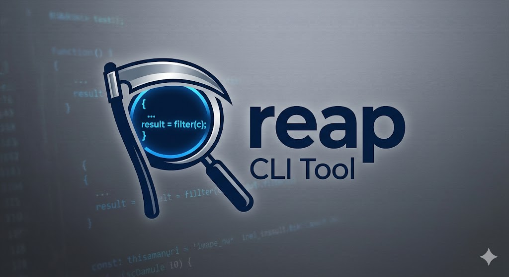

<p align="center">
  
</p>

# reap

[](https://github.com/osszoi/reap/actions/workflows/ci.yml)
[](https://github.com/osszoi/reap/releases/latest)
[](LICENSE)

`reap` is a fast, single-binary code health scanner for **Java** projects, built in Rust. One parse pass feeds a module graph that powers every section — hotspots, complexity, cycles, dead code, duplication, dependencies — so you get a complete picture of a codebase in seconds.

---

## What it analyzes

A single parse pass (tree-sitter) feeds a module graph, which feeds every section:

- **hotspots** — git churn × complexity density, recency-weighted (90-day half-life), with fan-in and a trend arrow.
- **high complexity functions** — cyclomatic (McCabe) and cognitive (SonarSource) complexity.
- **large functions** — functions over 60 lines.
- **circular dependencies** — import cycles between classes (Tarjan SCC), flagged cross-package.
- **unused files** — files unreachable from any entry point (main / tests / Spring beans / SPI).
- **unused exports** — public/protected methods with no caller elsewhere.
- **duplicates & clone families** — token-level duplicate blocks (suffix array + LCP).
- **unused & undeclared dependencies** — via `mvn dependency:analyze`.
- **refactoring targets** — a prioritized, ROI-ranked synthesis of all of the above.

> `bugs` and `dead-code` (SpotBugs/PMD-style findings) are still being ported to the Rust engine.

---

## Install

**Homebrew** (macOS / Linux):

```sh
brew install osszoi/tap/reap
```

**Shell installer** (macOS / Linux):

```sh
curl --proto '=https' --tlsv1.2 -LsSf https://github.com/osszoi/reap/releases/latest/download/reap-installer.sh | sh
```

**Windows** (PowerShell):

```powershell
irm https://github.com/osszoi/reap/releases/latest/download/reap-installer.ps1 | iex
```

**Manual:** download the archive for your platform from the [latest release](https://github.com/osszoi/reap/releases/latest), extract it, and put `reap` on your `PATH`.

**From source:**

```sh
git clone https://github.com/osszoi/reap
cd reap
cargo build --release
# binary at target/release/reap
```

---

## Requirements

- **git** — required for `hotspots` and `--compare-against`.
- **Maven (`mvn`)** in PATH — required only for the `deps` section.

Everything else (parsing, complexity, graph, duplicates) is built in and needs no external tools.

---

## Usage

```sh
reap                   # full scan: every section above
reap hotspots          # git churn × complexity ranking
reap complexity        # cyclomatic and cognitive complexity (+ large functions)
reap circular          # import cycles
reap unused-files      # unreachable files
reap unused-exports    # public methods with no external caller
reap deps              # unused / undeclared Maven dependencies
reap dupes             # duplicate blocks and clone families
reap targets           # prioritized refactoring recommendations
reap explain <topic>   # describe a section or metric (no scan)
```

---

## Options

| Flag | Default | Description |
|------|---------|-------------|
| `--fail-on <targets>` | `nullpointers` | Comma-separated fail conditions (see below) |
| `--max-complexity <n>` | `20` | Cyclomatic complexity threshold |
| `--max-cognitive <n>` | `15` | Cognitive complexity threshold |
| `--max-hotspot-score <n>` | none | Fail if a file exceeds this hotspot score |
| `--skip-compile` | — | Skip `mvn compile` (use when already built) |
| `--verbose` | — | Show medium and low severity findings |
| `--top <n>` | `20` | How many items to show per section |
| `--min-commits <n>` | `1` | Minimum commits for a file to rank as a hotspot |
| `--min-tokens <n>` | `50` | Minimum token length for a duplicate clone |
| `--min-lines <n>` | `5` | Minimum line height for a duplicate clone |
| `--skip-pattern <globs>` | — | Comma-separated globs to omit from the report (still analyzed) |
| `--compare-against <ref>` | — | Only report findings introduced vs `<ref>` (PR mode) |
| `--no-legend` | — | Hide the dim per-section keyword legends |

### `--fail-on` targets

| Value | Fails when |
|-------|-----------|
| `complexity` | Any function exceeds the complexity threshold |
| `large-functions` | Any function is over 60 lines |
| `circular` | Any circular dependency exists |
| `unused-files` | Any unreachable file exists |
| `unused-exports` | Any unused public method exists |
| `duplicates` | Any duplicate block exists |
| `hotspots` | Any file exceeds `--max-hotspot-score` |
| `nullpointers` | Any SpotBugs `NP_*` finding *(pending the SpotBugs port)* |
| `bugs` | Any high-severity SpotBugs finding *(pending the SpotBugs port)* |
| `all` | Any critical or high finding across all sources |

Multiple targets: `--fail-on=complexity,circular,duplicates`

---

## `explain` — what do the numbers mean?

Every section prints a dim one-line legend explaining its keywords and thresholds (turn off with `--no-legend`). For the full story on any metric, without scanning:

```sh
reap explain cyclomatic
reap explain hotspots
reap explain "unused exports"
```

Topic names are alias- and space-tolerant. `reap explain` with no topic lists them all.

---

## `--skip-pattern` — hide folders from the report

```sh
reap --skip-pattern=generated,legacy/old,**/dto
```

Matched files are **still fully analyzed** — they keep contributing to reachability, fan-in, cycles, and the duplicate corpus — but their findings are omitted from the report and from `--fail-on`. Useful for generated code or vendored folders you can't act on.

Entries are globs: a bare name like `generated` matches that folder anywhere in the tree; explicit globs (`**/*.generated.java`, `src/gen/**`) are respected as written.

---

## `--compare-against` — PR mode (introduced findings only)

```sh
reap --compare-against=master
```

Analyzes the whole project (so cross-file links stay correct), then reports **only findings on the code this branch actually introduced** vs `<ref>`. This is **line-level** changed-hunk scoping: editing a file does *not* blame the pre-existing methods you didn't touch — only the lines your diff added or modified are in scope.

This makes it safe as a merge-blocking GitHub check: it fails the PR on issues the author introduced, never on legacy code they merely sat next to. Hotspots are omitted (churn ranking is meaningless for one PR); dependency findings show only if the PR edited a `pom.xml`. If `<ref>` doesn't exist or it isn't a git repo, `reap` prints a notice and falls back to the full report.

---

## Exit codes

| Code | Meaning |
|------|---------|
| `0` | All thresholds passed |
| `1` | One or more `--fail-on` conditions triggered |
| `2` | Tool error (not a project directory, etc.) |

---

## CI usage

Block a PR on issues it introduces, without blaming pre-existing code:

```yaml
- run: reap --skip-compile --compare-against=${{ github.event.pull_request.base.ref }} --fail-on=complexity,circular,duplicates
```

Or a strict whole-repo gate:

```yaml
- run: reap --skip-compile --fail-on=complexity,circular --max-complexity=15
```

---

## How hotspots work

Hotspot score = recency-weighted commit frequency × complexity density, normalized to the worst file in the project. Commits are decayed with a 90-day half-life, so files that churned last month rank higher than files that churned years ago and stabilized. A file that is both complex and frequently changed is your highest-leverage place to reduce risk.

This is a direct port of fallow's algorithm, originally described in Adam Tornhill's *Your Code as a Crime Scene*.

---

## Acknowledgements

`reap`'s analysis algorithms — hotspot scoring, complexity metrics, duplicate detection, and the overall CLI design — are ported from [fallow](https://github.com/fallow-rs/fallow), which does the same for TypeScript. This project brings those ideas to the Java ecosystem.

---

## License

MIT
